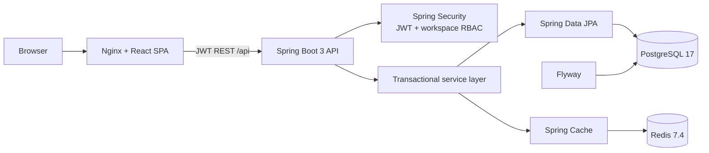
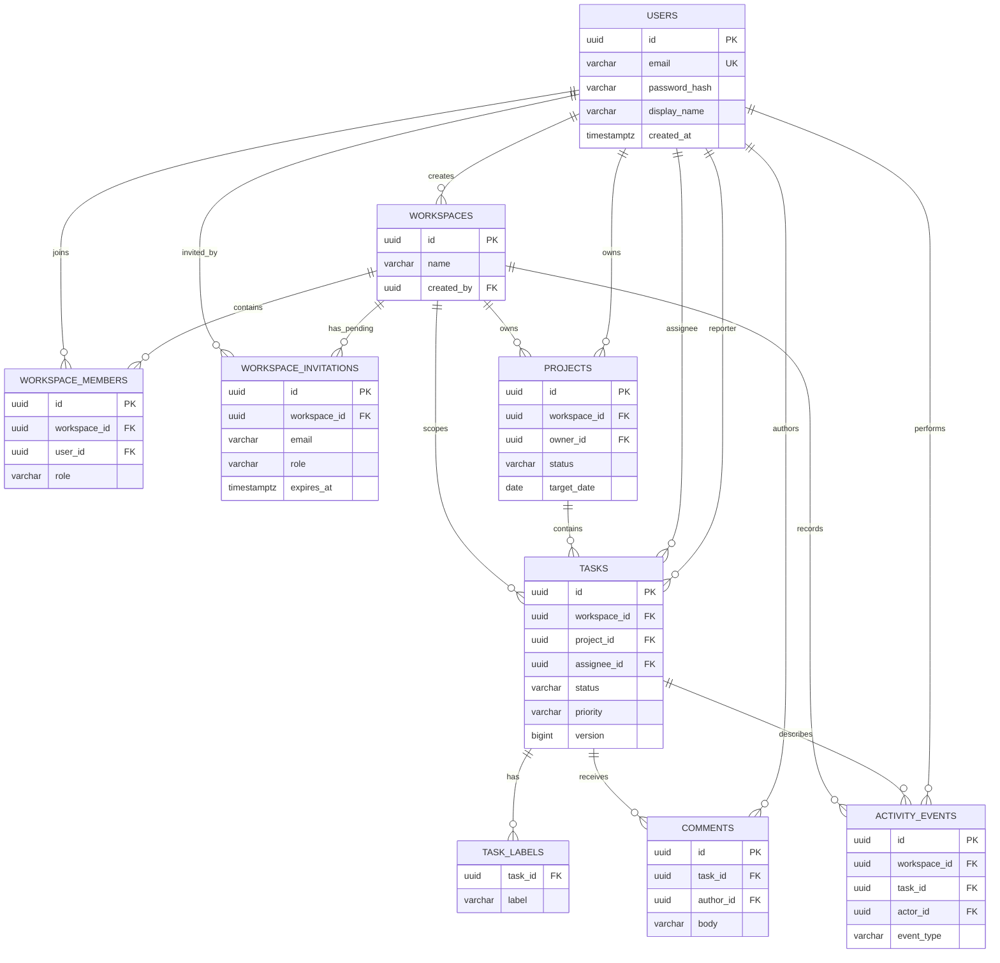

# TaskFlow Pro — Distributed Productivity Engine

[](https://github.com/Jyothsna-jgoru/taskflow-pro/actions/workflows/ci.yml)
[](https://openjdk.org/projects/jdk/21/)
[](https://spring.io/projects/spring-boot)
[](https://react.dev/)

TaskFlow Pro is a multi-user team productivity platform built as a production-minded full-stack portfolio project. Teams create isolated workspaces, organize projects, move tasks through a five-state workflow, collaborate in comments, and inspect live workload and delivery dashboards.

It demonstrates secure REST API design, workspace-scoped RBAC, relational modeling, optimistic concurrency, cache-aside Redis reads, testable service boundaries, containerized local operations, and repeatable CI.

## Live project

### Run the complete TaskFlow Pro demo

[▶ Start TaskFlow Pro with Docker Compose](#run-with-docker-compose)

Sign in with a seeded workspace to explore projects, task boards, workload charts, comments, activity history, and admin login history.

> The complete React, Spring Boot, PostgreSQL, and Redis application runs together through Docker Compose. The repository never claims an external live URL unless one has actually been published.

For the checked hosting configuration and the steps to publish it, see the [hosted deployment guide](docs/hosted-deployment.md).

## What problem it solves

Work tracking becomes unreliable when ownership, authorization, project context, and progress reporting live in separate tools. TaskFlow Pro keeps them in one tenant-aware system: every request is authorized against workspace membership, each meaningful change produces an audit event, and dashboards are computed from the same persisted work records users edit.

## What this project demonstrates

- JWT registration, login, logout, current-user lookup, BCrypt password hashing, and consistent JSON errors
- Privacy-friendly, admin-only login history that records successful workspace-member sign-ins by account and timestamp
- Workspace-scoped `ADMIN`, `MANAGER`, and `MEMBER` authorization with protected membership administration, pending invitations, role changes, and removals
- Projects with ownership, dates, progress, lifecycle states, and archival
- Paginated tasks with full-text search, filtering, sorting, labels, assignment, due dates, five workflow states, and four priorities
- Optimistic `version` checks that reject stale updates with `409 Conflict`
- Task comments and readable audit activity for creation, assignment, status, priority, project, workspace, and comment events
- Live dashboard totals, overdue/due-this-week counts, completion rate, status mix, project progress, member workload, and recent activity
- Redis cache-aside reads with user/workspace-aware keys, bounded TTLs, mutation-driven invalidation, and an environment switch
- Responsive React dashboard with loading/empty/error states, forms, validation, toasts, charts, project views, task board, task detail, team, and settings
- Flyway migrations, OpenAPI/Swagger, health checks, Docker Compose, Testcontainers, GitHub Actions, and controlled load-test tooling

## Architecture



The backend is a modular monolith with controllers, DTOs, services, repositories, entities, mappers, security, configuration, and centralized exceptions. PostgreSQL is authoritative; Redis can be removed or flushed without losing business data. See [the architecture guide](docs/architecture.md) for authorization, consistency, cache, and deployment decisions.

## Technology stack

| Area | Technology |
| --- | --- |
| Backend | Java 21, Spring Boot 3.5, Spring Web, Spring Security, Spring Data JPA, Hibernate, Maven |
| Data | PostgreSQL 17, Redis 7.4, Flyway |
| Security/API | JWT (JJWT), BCrypt, Bean Validation, springdoc OpenAPI |
| Frontend | React 19, TypeScript, Vite, React Router, TanStack Query, Axios |
| UI | Tailwind CSS, React Hook Form, Zod, Recharts, Lucide |
| Testing | JUnit 5, Mockito, MockMvc, Testcontainers, Vitest, Testing Library |
| Operations | Docker, Docker Compose, Nginx, GitHub Actions |

## Database model



## Run with Docker Compose

### Prerequisites

- Docker Desktop or Docker Engine with Compose v2
- Git
- At least 4 GB of memory available to Docker during the first image build

### Start

```bash
git clone https://github.com/Jyothsna-jgoru/taskflow-pro.git
cd taskflow-pro
cp .env.example .env
docker compose up --build
```

PowerShell equivalent for the environment file: `Copy-Item .env.example .env`.

Change `JWT_SECRET` and the database password in `.env` before sharing a running instance. The Compose defaults are intentionally local-development values, not production secrets.

| Service | Local URL/port |
| --- | --- |
| Web application | http://localhost:3000 |
| Backend API | http://localhost:8080/api |
| Swagger UI | http://localhost:8080/swagger-ui.html |
| OpenAPI JSON | http://localhost:8080/v3/api-docs |
| Health | http://localhost:8080/actuator/health |
| PostgreSQL | `localhost:5432` |
| Redis | `localhost:6379` |

Stop containers with `docker compose down`. Add `-v` only when you intentionally want to erase local PostgreSQL and Redis volumes.

## Demo accounts

Demo records are inserted idempotently only under the `dev` profile used by Compose.

| Workspace role | Email | Password |
| --- | --- | --- |
| Admin | `admin@taskflow.local` | `Admin123!` |
| Manager | `manager@taskflow.local` | `Manager123!` |
| Member | `member@taskflow.local` | `Member123!` |

The seeded **Northstar Product** workspace contains three projects, six varied tasks, assignments, labels, comments, overdue work, and recent activity so every dashboard area has real database-backed data.

## Local development without rebuilding app containers

Start only infrastructure:

```bash
docker compose up postgres redis -d
./mvnw spring-boot:run -Dspring-boot.run.profiles=dev
```

In another terminal:

```bash
cd frontend
npm ci
npm run dev
```

Vite serves the UI at http://localhost:5173 and proxies backend routes to port 8080.

## Environment variables

| Variable | Default | Purpose |
| --- | --- | --- |
| `POSTGRES_DB` | `taskflow` | Compose database name |
| `POSTGRES_USER` | `taskflow` | Compose/database user |
| `POSTGRES_PASSWORD` | local-only value | Database password; change outside local use |
| `DB_URL` | `jdbc:postgresql://localhost:5432/taskflow` | Spring JDBC URL |
| `DB_USERNAME` | `taskflow` | Spring database user |
| `DB_PASSWORD` | `taskflow` | Spring database password |
| `REDIS_HOST` | `localhost` | Redis host |
| `REDIS_PORT` | `6379` | Redis port |
| `JWT_SECRET` | development-only fallback | HMAC secret, minimum 32 bytes |
| `JWT_TTL_MINUTES` | `60` | Access-token lifetime |
| `CACHE_ENABLED` | `true` | Enable Redis-backed Spring caching |
| `DASHBOARD_CACHE_TTL` | `PT2M` | ISO-8601 dashboard TTL |
| `QUERY_CACHE_TTL` | `PT1M` | ISO-8601 task/project TTL |
| `CORS_ORIGINS` | localhost UI origins | Comma-separated allowed browser origins |
| `SERVER_PORT` | `8080` | API port |

Never commit `.env`; only `.env.example` is versioned.

## Cache strategy

- `dashboard`: current user + workspace key; two-minute default TTL
- `tasks`: current user + workspace + every filter/paging/sort input; one-minute default TTL
- `projects`: current user + workspace; one-minute default TTL

Task and project mutations evict dependent dashboard, project, and task caches. Membership and workspace changes evict all three logical caches because they may alter access, ownership, or workload. Comments evict dashboard data because recent activity changes. Redis is disabled cleanly with `CACHE_ENABLED=false`; uncached service execution remains correct.

The current implementation favors broad per-cache eviction after mutations. It is deliberately conservative: simple correctness is preferable to a fragile distributed key registry at this scale.

## Testing and quality checks

```bash
# Backend unit and MockMvc tests (integration class is skipped without the flag)
./mvnw test

# Apply Java formatting
./mvnw spotless:apply

# Include disposable PostgreSQL + Redis Testcontainers
RUN_INTEGRATION_TESTS=true ./mvnw verify

# Frontend
cd frontend
npm ci
npm audit --omit=dev --audit-level=high
npm run format:check
npm run lint
npm run test
npm run build

# Validate deployment configuration
docker compose config --quiet
```

On PowerShell, run `$env:RUN_INTEGRATION_TESTS='true'; .\mvnw.cmd verify`. CI executes the Testcontainers suite on every push and pull request in addition to frontend lint, tests, build, and Compose validation.

The integration flow verifies registration, authentication, workspace/member RBAC, cross-workspace denial, projects, tasks, comments, activity, dashboard reads, PostgreSQL persistence, Redis population, and mutation-driven cache invalidation.

### Current local verification

| Check | Result |
| --- | --- |
| `./mvnw verify` | Passed: 7 tests; Testcontainers integration test skipped because the Docker daemon was unavailable |
| `npm run format:check` | Passed |
| `npm run lint` | Passed with zero warnings |
| `npm run test` | Passed: 1 Vitest test |
| `npm run build` | Passed: production bundle generated |
| `npm audit --omit=dev --audit-level=high` | Passed: 0 reported vulnerabilities |
| `docker compose config --quiet` | Passed |

This table distinguishes source/build verification from container runtime evidence. It will be updated only after the Docker-backed integration, smoke, screenshot, and load-test runs complete.

## API documentation

Open Swagger UI after the backend is running and use **Authorize** with the token returned by login. See [API examples](docs/api-examples.md) for `curl` flows covering auth, workspaces, projects, filtered tasks, optimistic updates, comments, and dashboards.

## Performance validation

The repository includes a dependency-free controlled load runner at `load-tests/load_test.py`. It authenticates against the real backend and exercises dashboard, task-list, and project reads concurrently. See [performance testing](docs/performance-testing.md) for the exact command and interpretation rules.

**Verified result:** no load-test number is published until the full Docker stack has been measured successfully. This protects the portfolio and resume from unverified claims. Raw JSON is retained whenever a result is promoted here.

## Screenshots

Real screenshots are added only from a successfully running application backed by its API and seeded PostgreSQL data. No mock or generated screenshot is presented as runtime evidence.

## Repository structure

```text
taskflow-pro/
├── .github/                 # CI and structured issue templates
├── docs/                    # Architecture, API, performance, implementation plan
├── frontend/                # React/TypeScript SPA and Nginx container
├── load-tests/              # Authenticated local load runner
├── src/main/java/           # Spring controllers/services/data/security/config
├── src/main/resources/      # Profiles and Flyway migrations
├── src/test/java/           # Unit, MockMvc, and Testcontainers tests
├── docker-compose.yml       # Full local topology
├── Dockerfile               # Multi-stage backend image
├── pom.xml                  # Maven build
└── .env.example             # Safe configuration template
```

## Security notes and known limitations

- This version uses short-lived access tokens without refresh-token rotation or server-side revocation. Logout discards the browser token.
- Rate limiting is not included; a real multi-instance deployment should add a Redis-backed limiter at the gateway or API boundary.
- Admins can add existing accounts immediately or create a seven-day pending invitation for a new email. TaskFlow copies an opaque registration link that locks the invited email on the registration screen; the admin shares that link through their normal team channel. This build deliberately does not send email itself.
- Cache eviction is intentionally broad within each logical cache; large installations should use workspace-indexed keys or event-driven invalidation.
- Compose is a local/development deployment. Production still requires TLS, secret management, backups, observability, and infrastructure-specific hardening.

## Future improvements

- Refresh-token rotation and explicit session/device management
- WebSocket/SSE task updates and notification preferences
- File attachments backed by an S3-compatible local store such as MinIO
- Workspace-indexed cache eviction and API rate limiting
- Accessibility audit, end-to-end browser suite, tracing, and production metrics
- Deployment templates and production runbooks for managed infrastructure

## Resume-ready description

> Built a multi-user productivity platform using Java 21, Spring Boot, React, PostgreSQL, and Redis with JWT-based workspace RBAC, project/task workflows, optimistic concurrency, data-driven dashboards, documented REST APIs, containerized local execution, and automated backend/frontend quality checks.

Measured caching or load-test improvements should be appended only after reproducing and retaining the benchmark evidence.

## License

MIT — see [LICENSE](LICENSE).
