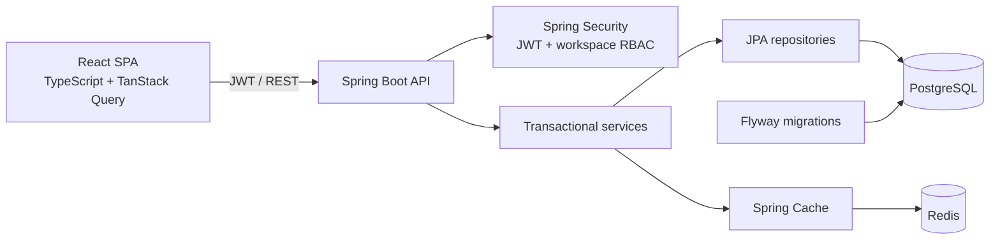

# Architecture

## System boundaries

TaskFlow Pro is a modular monolith: one stateless Spring Boot API owns business rules and persistence, while a React single-page application consumes its REST interface. PostgreSQL is the system of record. Redis is a disposable read cache, never an authority for authorization or task state.

## Authorization model

Roles are workspace-scoped, not global. Every workspace, project, task, comment, activity, and dashboard operation first resolves the authenticated user and membership. `ADMIN` can change settings and membership; `ADMIN` and `MANAGER` can mutate projects and tasks; every member can read workspace data and collaborate through comments. Repository lookups include the workspace identity so an object UUID from another workspace cannot cross the tenant boundary.

JWT access tokens are signed with HMAC and are short-lived. Passwords are BCrypt hashes. Because the API is stateless, logout removes the token from the browser; there is no server-side refresh-token store in this version.

## Consistency and concurrency

- Service mutations run in database transactions.
- `TaskItem` uses JPA `@Version`; update requests must carry the last observed version. A stale request receives HTTP `409 Conflict` rather than silently overwriting a teammate's work.
- Activity events are written in the same transaction as their associated business mutation.
- Flyway owns the schema and Hibernate validates it at startup.
- Indexed workspace/project/status/priority/assignee/due-date columns support the main list queries.

## Cache model

Dashboard, filtered task-page, and project-summary responses use cache-aside reads. Keys include the authenticated email and workspace UUID; task keys also contain the complete filter/paging/sort tuple. This prevents data from one user or query variant from being served to another.

Default TTLs are two minutes for dashboards and one minute for task/project reads. Task, project, membership, workspace, and comment mutations evict dependent caches after a successful transaction. Eviction currently clears each affected logical cache rather than maintaining a complex key index; that favors correctness and simple operations for the portfolio-scale deployment. Set `CACHE_ENABLED=false` to bypass Redis caching while debugging.

## Deployment posture

Docker Compose is the supported zero-cost local target. Nginx serves the compiled SPA and proxies API/documentation routes to an unprivileged Java runtime container. PostgreSQL and Redis use named volumes and health-gated startup. Production deployment would additionally require TLS termination, managed secret injection, backups, monitoring, stricter network segmentation, and horizontally shared rate limiting.
